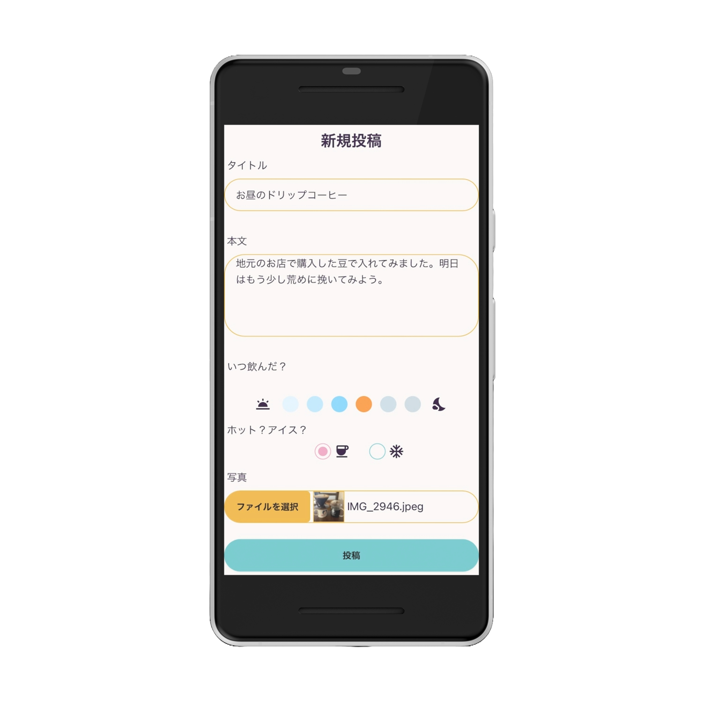
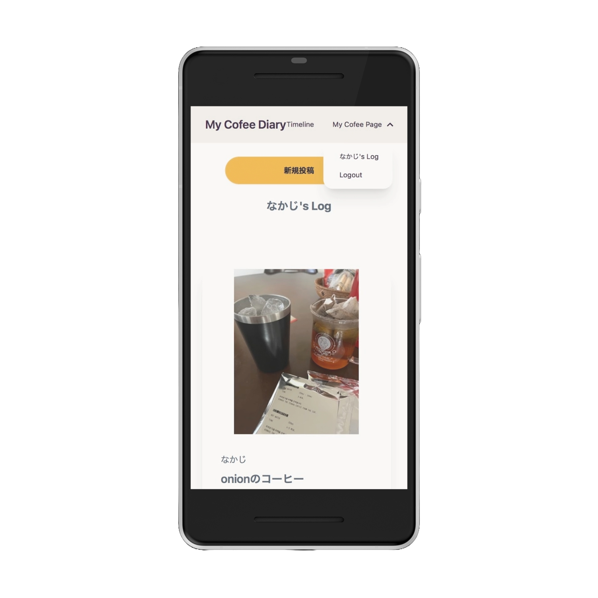

# サービス名：My Coffee Diary

## サービス概要
毎日のコーヒーを気軽に記録することができるアプリケーションです。コーヒーの味、その時の気持ち、一緒に飲んだ相手などを写真とともに「自由に」記録できます。
## サービスURL
https://my-coffee-diary-beb5a70ee3d8.herokuapp.com/
## 機能紹介
|投稿画面| マイページ |
|:-:|:-:|
||
タイトルや本文は自由に入力できるようにしました。飲んだ時間とホット・コールドに関してはラジオボタンで入力しやすくしています。|自分が過去に飲んだコーヒーを振り返ることができます。豆の挽き方、美味しいお店のコーヒー、その時の思い出などを振り返ることができます。|
## 技術構成
### 使用技術
| カテゴリー | 使用技術 |
:----|:----
| フロントエンド | Ruby on Rails  7.1.3.3, TailwindCSS, DaisyUI |
| バックエンド | Ruby on Rails  7.1.3.3 (Ruby 3.2.3 )  |
| インフラ | heroku / AmazonS3 |
| DB | PostgreSQL |
| 開発環境 | Docker |
### 選定理由
スクールのカリキュラムで学習しているRuby on Rails＋Dockerを使うことで、実装のスピードを上げられると考えました。TailwindCSSのライブラリであるDaisyUIのテーマを使用することで、統一感のあるアプリケーションにできそうだと感じたため、TailwindCSS及びDaisyUIを使用しました。
### 技術面でのアピールポイント
日々のコーヒーを写真とともに記録するためのアプリということで、レスポンシブ対応を最も重要な課題として開発を進めました。またラジオボタンを使用して直感的に入力がしやすいように実装しました。
## Webアプリを開発するに至った経緯
気軽に飲んだコーヒーの記録をできるアプリがあったらいいなと感じたことがきっかけです。ここ数ヶ月、ほぼ毎日豆を挽いてドリップコーヒーを入れています。せっかく毎日入れているのだから何か記録に残せたらいいなと思い、今回のアプリの作成に至りました。
## このWebアプリならではのポイント
「コーヒー」に関わることであれば自由に投稿できるアプリという点です。記録する内容は、コーヒーの入れ方でもいいですし、一緒に飲んだ人がいるのならそこでの会話を記録してもいいというように、ゆるっと自由な使い方ができるアプリとなっています。
